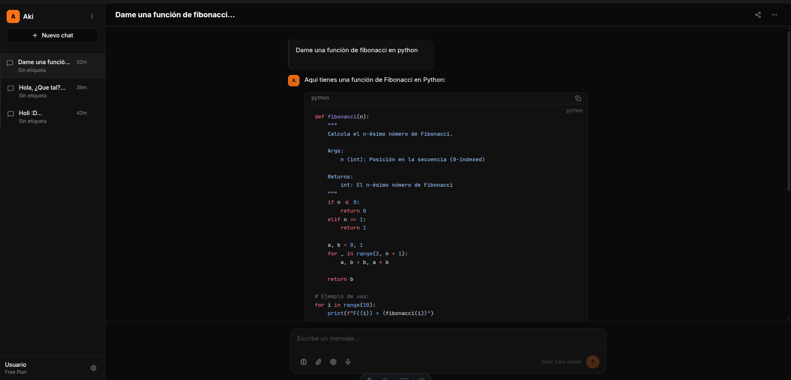

# 🤖 Aki - Tu Asistente de IA con Herramientas

<div align="center">



**Un asistente de IA potenciado por Ollama con capacidades de manipulación de archivos, autenticación segura y chats compartidos**

[](https://astro.build)
[](https://react.dev)
[](https://www.typescriptlang.org/)
[](LICENSE)

</div>

---

## 📖 Descripción

Aki es un asistente de IA conversacional que puede interactuar con tu sistema de archivos y ejecutar comandos de forma segura. Construido con tecnologías modernas como Astro, React y TypeScript, ofrece una interfaz web intuitiva para comunicarte con modelos de IA locales.

### ✨ Características Principales

- 🔐 **Autenticación Segura**: Sistema de login con sesiones y contraseñas hasheadas
- 🗂️ **Manipulación de Archivos**: Leer, escribir, listar y buscar archivos
- 📎 **Archivos Adjuntos**: Sube archivos hasta 6MB para compartir con el agente
- 💻 **Ejecución de Comandos**: Ejecuta comandos de shell de forma segura
- 🔒 **Sandbox Seguro**: Operaciones limitadas a un directorio de trabajo
- 🚀 **Streaming en Tiempo Real**: Respuestas de IA transmitidas en vivo
- 💭 **Modo de Pensamiento**: Visualiza el razonamiento del modelo
- 🎨 **Interfaz Moderna**: UI limpia con soporte para tema oscuro
- 📤 **Chats Compartidos**: Genera links públicos para compartir conversaciones
- 🔧 **Gestión de Chats**: Eliminar, renombrar, duplicar y exportar conversaciones
- 🔔 **Notificaciones**: Feedback visual con toast notifications

---

## 🛠️ Tecnologías

| Tecnología | Propósito |
|------------|-----------|
| **Astro** | Framework web full-stack |
| **React 19** | UI components |
| **TypeScript 5.5** | Tipado estático |
| **Ollama** | API de IA local |
| **Drizzle ORM** | Base de datos SQLite |
| **Tailwind CSS** | Estilos |
| **shadcn/ui** | Componentes UI |
| **Vitest** | Testing |
| **Biome** | Linting y formateo |
| **bcryptjs** | Hashing de contraseñas |
| **rehype-sanitize** | Sanitización de contenido |

---

## 📋 Requisitos Previos

- **Node.js** >= 22.12.0
- **pnpm** (gestor de paquetes)
- **Ollama** instalado y ejecutándose
- **API Key de Ollama Cloud** (opcional)

---

## 🚀 Instalación

### 1. Clonar el repositorio

```bash
git clone https://github.com/beresiartejuan/aki.git
cd aki
```

### 2. Instalar dependencias

```bash
pnpm install
```

### 3. Configurar variables de entorno

Crea un archivo `.env` en la raíz del proyecto:

```env
# Base de datos
DB_PATH=./data/aki.db

# API de Ollama
OLLAMA_API_KEY=tu_api_key_aqui
OLLAMA_MODEL=qwen3.5

# Directorio de trabajo
WORKSPACE_ROOT=./workspace

# Directorio de uploads
UPLOADS_DIR=./uploads
```

### 4. Inicializar la base de datos

```bash
pnpm db:generate
pnpm db:migrate
node --import=tsx scripts/init-db.ts
```

### 5. Crear usuario de acceso

```bash
npx tsx scripts/setup-user.ts admin TuPasswordSegura
```

### 6. Crear directorios necesarios

```bash
mkdir -p uploads workspace data
```

### 7. Iniciar el servidor de desarrollo

```bash
pnpm dev
```

¡Listo! Abre tu navegador en `http://localhost:4321` e inicia sesión con tus credenciales.

---

## 💻 Comandos Disponibles

| Comando | Descripción |
|---------|-------------|
| `pnpm dev` | Inicia el servidor de desarrollo |
| `pnpm build` | Compila para producción |
| `pnpm preview` | Vista previa del build |
| `pnpm test` | Ejecuta los tests |
| `pnpm test:ui` | Tests con interfaz gráfica |
| `pnpm lint` | Ejecuta el linter |
| `pnpm format` | Formatea el código |
| `pnpm check` | Lint + formato + organización de imports |
| `pnpm db:studio` | Abre Drizzle Studio |
| `pnpm db:generate` | Genera migraciones |
| `pnpm db:migrate` | Aplica migraciones |

---

## 📁 Estructura del Proyecto

```text
aki/
├── src/
│   ├── components/        # Componentes React
│   │   ├── chat/          # Componentes del chat
│   │   └── ui/            # Componentes UI base
│   ├── db/                # Esquemas y consultas DB
│   │   ├── queries/       # Funciones de consulta
│   │   ├── schema.ts      # Esquema Drizzle
│   │   └── seed.ts        # Datos iniciales
│   ├── lib/               # Lógica del servidor
│   │   ├── agent.ts       # Bucle del agente
│   │   ├── tools/         # Herramientas del agente
│   │   ├── ollama.ts      # Cliente Ollama
│   │   └── constants.ts   # Constantes
│   ├── middleware.ts      # Autenticación y protección de rutas
│   ├── pages/             # Páginas Astro
│   │   ├── api/           # Endpoints API
│   │   ├── login.astro    # Página de login
│   │   └── shared/        # Chats compartidos públicos
│   ├── styles/            # Estilos globales
│   └── env.ts             # Variables de entorno
├── data/                  # Base de datos SQLite
├── uploads/               # Archivos adjuntos
├── workspace/             # Directorio de trabajo del agente
├── public/                # Archivos estáticos
└── scripts/               # Scripts de utilidad
    ├── init-db.ts         # Inicialización de DB
    └── setup-user.ts      # Gestión de credenciales
```

---

## 🔐 Autenticación

### Características de Seguridad

- **Sesiones seguras**: Cookies httpOnly con expiración de 7 días
- **Contraseñas hasheadas**: Uso de bcrypt con 12 rounds
- **Protección de rutas**: Middleware que redirige a login si no hay sesión activa
- **Rutas públicas**: `/login`, `/api/auth/*`, `/shared/*` no requieren autenticación

### Gestión de Usuarios

```bash
# Crear o actualizar credenciales
npx tsx scripts/setup-user.ts <username> <password>

# Ejemplo
npx tsx scripts/setup-user.ts admin MiPasswordSegura123
```

---

## 🗂️ Gestión de Chats

### Operaciones Disponibles

- **Crear**: Botón "Nuevo chat" en la sidebar
- **Eliminar**: Menú contextual → Eliminar (con confirmación)
- **Renombrar**: Doble click o menú contextual → Renombrar
- **Duplicar**: Menú contextual → Duplicar
- **Exportar**: Menú superior → Exportar a Markdown

### Organización

- Los chats se ordenan por fecha de última actualización
- Indicador de tiempo relativo (ahora, 5m, 2h, 3d)
- Etiquetas de proyecto para categorización

---

## 📎 Sistema de Archivos Adjuntos

### Características

- **Límite**: 6MB por archivo
- **Almacenamiento**: Local en directorio `./uploads/`
- **Tipos soportados**: Imágenes (preview inline), archivos de texto, cualquier extensión
- **Persistencia**: Los archivos se asocian a mensajes específicos

### Uso

1. Click en el botón "Adjuntar" en el input de chat
2. Selecciona el archivo desde tu dispositivo
3. El archivo se sube automáticamente al enviar el mensaje
4. Los archivos se muestran en el mensaje con preview o link de descarga

---

## 📤 Chats Compartidos

### Características

- **Links públicos**: Generados automáticamente con hash único
- **Expiración**: 3 días por defecto (configurable)
- **Acceso sin auth**: Los links públicos no requieren login
- **Revocación**: El propietario puede desactivar el link en cualquier momento
- **QR Code**: Fácil compartir desde dispositivos móviles

### Cómo Compartir

1. Abre un chat existente
2. Click en el botón "Compartir" (ícono de link) en la barra superior
3. Se genera un link único tipo `http://localhost:4321/shared/abc123`
4. Copia el link o escanea el QR code
5. Para revocar: Click en "Revocar acceso" en el mismo menú

---

## 🔧 Herramientas del Agente

El agente tiene acceso a las siguientes herramientas para interactuar con el sistema:

### Sistema de Archivos
- `read_file` - Leer contenido de archivos
- `write_file` - Escribir contenido en archivos
- `list_directory` - Listar contenido de directorios
- `create_directory` - Crear directorios
- `delete_file` - Eliminar archivos
- `delete_directory` - Eliminar directorios
- `move_file` - Mover/renombrar archivos
- `search_files` - Buscar archivos por patrón

### Shell
- `run_command` - Ejecutar comandos en el workspace

---

## 🔒 Seguridad

### Autenticación
- Contraseñas hasheadas con bcrypt (12 rounds)
- Sesiones con cookies httpOnly, secure, sameSite
- Expiración automática de sesiones en 7 días
- Cleanup de sesiones expiradas

### Sandbox de Archivos
- Todas las operaciones están limitadas al directorio `WORKSPACE_ROOT`
- Validación automática de rutas para prevenir acceso no autorizado
- Límites de tamaño: archivos > 100KB se truncarán

### Ejecución de Comandos
- Lista de comandos bloqueados (rm -rf /, sudo, curl, etc.)
- Timeout automático de 15 segundos
- Output limitado a 8000 caracteres

### Sanitización de Contenido
- Markdown renderizado con rehype-sanitize para prevenir XSS
- Validación de tipos de archivos adjuntos
- Límite de tamaño en uploads (6MB)

---

## 🧪 Testing

El proyecto incluye un conjunto comprehensivo de tests unitarios:

```bash
# Ejecutar todos los tests
pnpm test

# Tests con interfaz gráfica
pnpm test:ui

# Tests en modo watch
pnpm test -- --watch
```

---

## 🤝 Contribuir

¡Las contribuciones son bienvenidas! Por favor, sigue estos pasos:

1. Haz fork del proyecto
2. Crea una rama para tu feature (`git checkout -b feature/nueva-funcionalidad`)
3. Haz commit de tus cambios (`git commit -m 'Agrega nueva funcionalidad'`)
4. Push a la rama (`git push origin feature/nueva-funcionalidad`)
5. Abre un Pull Request

### Estándares de Código

- Ejecuta `pnpm check` antes de hacer commit
- Todos los tests deben pasar
- El código debe seguir las reglas de Biome
- Mantén la cobertura de tests

---

## 📄 Licencia

Este proyecto está bajo la Licencia MIT. Ver el archivo [LICENSE](LICENSE) para más detalles.

---

## 🙏 Agradecimientos

- [Ollama](https://ollama.ai) por proporcionar acceso a modelos de IA locales
- [Astro](https://astro.build) por el excelente framework full-stack
- [shadcn/ui](https://ui.shadcn.com) por los componentes hermosos
- [Biome](https://biomejs.dev) por las herramientas de calidad de código

---

<div align="center">

**Hecho con ❤️ por [Beresiarte](https://github.com/beresiartejuan)**

</div>
